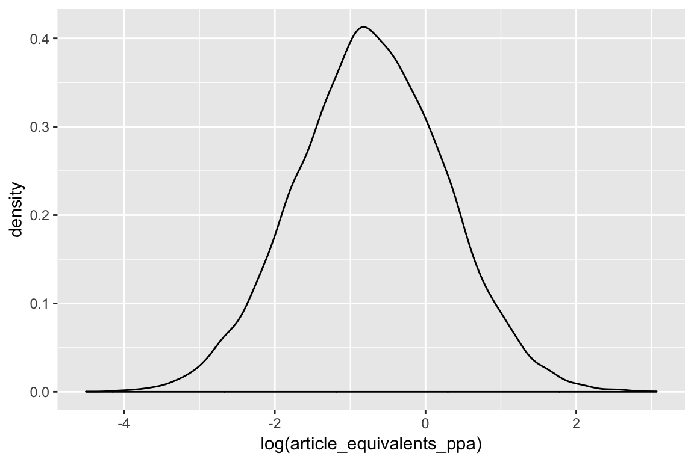
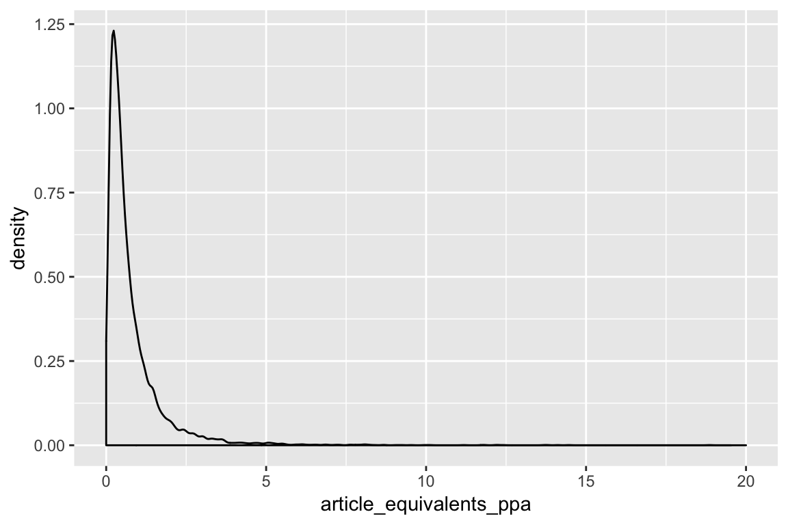

<div class="layout-chunk" data-layout="l-body">


</div>


## Status: WORK IN PROGRESS -- DRAFT ##

Problem 1: Estimating the percentage of researchers who engage in a particular QRP provides some information about the extent of the practice, and its potential impact on the literature. However, it doesn't allow us to get an estimate of how many studies or papers might have been affected by this QRP -- this is what we really care about, and the proportion of researchers engaging in a practice will not translate very accurately (or precisely) to the proportion of the literature effected. 

We *can* estimate the proportion of researchers engaging in this practice (asking them whether have engaged in this practice at least once), and then potentially estimate the proportion of literature affected... but there is a lot of uncertainty in this, largely due to the fact people are authoring multiple papers and might not always engage in the QRP, and we can't know how many 'impacted' papers each author might contribute in the published body of literature.

You *could* ask people about the number of papers they've authored, and the number of times in which they've done that practice. You could then arrive at some mean.  We *could* model proportions for this survey design, but it is difficult and finicky (says Jian). And, these estimates are likely to be unreliable. Why? because there is "imperfect detection" when using the common survey method for eliciting QRP rates from individuals -- people might either falsely deny they have engaged in the practice. Alternatively, they might not be able to properly recall whether they have engaged in the practice or not, or the number of papers that they have authored, especially people with longer research careers.

In the case of "imperfect admission" we cannot distinguish non-admission from a true negative, i.e. never having engaged in the practice. This will mean that our estimates will be biased.

So in order to account for our inability to adequately observe the true rate of engagement in QRP's within the survey sample, we can model the two processes explicitly and simultaneously using hierarchical modelling. Treating the 'state process' and the 'observation process' separately. The two processes are said to be hierarchical because parameters at one level govern parameters at the lower level. This modelling method is commonly used in occupancy-detection modelling within ecology.

## Model Description 

I follow the logic of a two-process occupancy-detection model presented here: [https://cals.arizona.edu/~steidl/HM/2_Introduction_to_Hierarchical_Models_and_Occupancy.pdf](https://cals.arizona.edu/~steidl/HM/2_Introduction_to_Hierarchical_Models_and_Occupancy.pdf).

There are two types of response, ("Admitted" and "Did not Admit"):

<div class="layout-chunk" data-layout="l-body">
preserve7da8862a88657bb6

</div>


The grey boxes represent the observable process "admission". And the pink circles represent the unobservable process, "true engagement rate in a QRP".

### Example --

Let's pretend we have the following results from a survey where we ask 4 researchers about how many papers they've authored for a given modelling type, and how many of those papers did they engage in a particular QRP. 1's represent engagement by a given individual in the QRP for that paper. 0's represent non-engagement for that paper.

<div class="layout-chunk" data-layout="l-body">

----------------------------------------------------
 individual   paper_1   paper_2   paper_3   paper_4 
------------ --------- --------- --------- ---------
     1           0         1         1         0    

     2           1         1         1         1    

     3           1         0         0        NA    

     4           0         0         0         0    
----------------------------------------------------

</div>


If the surveys were perfect, all 0's would indicate a true absence or true never having engaged in the QRP. Hence, we can estimate $\psi$ as the "naive" proportion of people with $\ge1$ admission:

$\psi = 3/4 = 0.75$

From above, if surveys are imperfect, we estimate $p$ from people with greater than one admission:

$p = (0.5 + 1 + 0.3)/3 = 0.6$

So the imperfect detection estimates also ends up accounting for the fact that some people do it *more* than others?

## Two processes: engagement and admissin

We want to estimate two processes separately:

1. Engagement A person will either engage wiht probability $\psi$  or not engage with probability $1-\psi$.
2. Detection / admission: If the person hasn't engaged, tthe person will not admit tto the QRP. If a person *has* engaged, then at each article there is some probability of recalling, and thterefore admitting to and detecting the practice.

Admitted $= \psi$
No admitted = $1 - \psi$ or $\psi(1 - p)$

**Binomial distribution**

$n$ is the number of "trials", or in this case, "papers" which are opportunities for people to engage in the QRP or not. Engaging in the QRP is equivalent to $p$, probability of success, for each "trial" (paper).

*Engagement Process*

${ Z }_{ i }\~ Bin(1,\psi)$

Where ${ Z }_{ i }$ is the unobservable true engagement rate, and is binomially distributed, and $\psi$ is the probability of engagement.

*Observation process*

${ Y }_{ ij}\~Bin(1,{ \quad Z }_{ i }-p)$

Where ${ Y }_{ ij }$ is the observed outcome, ${ Z }_{ i }$ is the unobservable true engagement rate. and $p$ is the probability of admission.

## Assumptions and potential problems:

1. Never falsely admit when didn't engage
2. Admission by an individual is independent from the admission of all other individuals
3. engagement in QRP does not change over the time period we elicited for
4. $\psi$ and $p$ are constant across individuals unless heterogeneity in parameters can be explained by covariates.

**OK:** 
- 1,
- 3: I don't think the overall rate per person changes over a small time-frame. Maybe over a long time-frame. But also, probably not, because I believe people use the same method they've always been taught.

**Maybe:**

-  2 (No: people exist in a broader culture, yes: people have differing views about whether it is defensibel or not, and therefore their admission is likely to differ, based on those views). 
- 4: Could go either way... I suspect there will be some practices that people largely don't believe are questionable and are commonly done, in those cases $\psi$ is likely to be constant across individuals. With increasing disagreement in the defensibility of these practices among people, $\psi$ is likely to differ, with those thinking the practice is defensible likely to engage, and those disagreeing with the practice likely not to.

After checking with Jian, the fact that the number of 'trials' or papers in this case, differs among individuals is OK, because these values are eventually aggregated into proportions, our measurable process.

### Accounting for heterogeneity: 

- individual-level (for $\psi$ and $p$)
- observation level co-variates (i.e., admission for a given paper $p$)

$\psi$ can be modelled as a function of individual level co-variates, BUT covariates for $\psi$ must remain constant during the survey period. Ecological examples are plant-community, or patch-size.

$p$ can be modelled as a function of 

- individual level co-variates, (ecological examples include veg cover or site).
- Covariates for each paper or article. (ecological examples include cloud cover, air-temp, observer).

I don't think that $p$ will waver during the course of the survey (over the ~5 years elicited for). Hmmm.. unless there was a really high profile paper in there... But the survey is anonomous, so unlikely to not admit for one over another. 

## Why this is this approach a good idea

1. Cool if we could get a sense of the proportion of literature affected by QRP (no one else has done this)
2. accounting explicitly for uncertainty in people's self-reported engagement
2. This is a modelling method that ecologists will be able to relate to
4. Jian thinks its worthwhile pursuing this appraoch

** notes from meeting with Jian** 

Jian thinks the occupancy-detection modelling approach is a great idea. 

- This is modelling at the observation level of the paper (nested under an individual). So we're going to need some covariates to apportion this variation to. 

The benefit of this approach is that we can properly extrapolate to the broader literature base to make some proper estimate of the proportion of literature impacted by the QRP.

One down-side is that it's going to take careful thought about what those covariates are, and they're going to have to be at th elevel of the study / paper. So think things like imapct-factor -- or other variables that you can web scrape things for that you can measure without reading all studies.

I've only been thinking about things at the level of the individual, so things like attitudes towards defensibility of the practice. If you're more aware are you more open? Or are you more open because you think the practice is fine and therefore have nothing to hide? Both individual level and observation level co-variates are necessary.

Also, Jian confirmed that having different *n* trials for each individual is ok, because this variation (and uncertainty) is subsumed into variation within the aggregated values of proportions of times QRP committed per individual. Variation in *p* can be partly driven by people's uncertainty in their ability to recall the number of papers *n* and also the number of times they committed the QRP across those papers *p*.


# Is this going to be a good approach? Simulating some test data to think about possible results..

To think about what some plausible outcomes would be and what information it might provide, we could run a few different simulation scenarios.

1. Different engagement rates: "low", "high", using rates from Hannah's paper.
2. Different admission rates: There's the risk that we are seriously underestimating the true engagement rate because admission rates are very low (Unlikely, given hannah's )

What are plausible covariates if assumption 4 doesn't hold?

## Simulate some data

"The publication rate varies significantly among the individuals, and is not normally distributed" Rorstad et al. Can use their models to simulate publication rate data.

### All assumptions OK (simplest form, no covariates)

Our model will require data for the following variables:
For each individual, we need ${p}_{ij}$, the probability of admission of QRP and $j$ the number of papers per individual. From our survey data this will be summarised from a dataframe where for each individual, for each paper, we have a `<logical>` response, as to whether the practice was undertaken in that paper ($1$), or not ($0$).

We can first simulate some data for the number of papers

<div class="layout-chunk" data-layout="l-body">

```
[1] "location: -0.720102455387355"
[1] "shape: 0.984256188059069"
```



</div>


OK, so now all we need is to think about the rate of QRP's. We'll simulate a few different scenarios, based on Table 1 from Fraser et al.:

1. 63.7 +-6
2. 23.9% +- 6
3. 2% +- (0.08 - 5.1)


<div class="layout-chunk" data-layout="l-body">

```
[1] "location: -0.777820536051909"
[1] "shape: 1.04124752343604"
```

```
# A tibble: 1,000 x 4
# Groups:   individual [1,000]
   individual paper_num QRP_rate_indiv QRP_yes  
        <int> <list>             <dbl> <list>   
 1          1 <int [2]>          0.682 <int [2]>
 2          2 <int [7]>          0.654 <int [7]>
 3          3 <int [9]>          0.678 <int [9]>
 4          4 <int [1]>          0.590 <int [1]>
 5          5 <int [1]>          0.576 <int [1]>
 6          6 <int [1]>          0.539 <int [1]>
 7          7 <int [1]>          0.601 <int [1]>
 8          8 <int [2]>          0.587 <int [2]>
 9          9 <int [7]>          0.643 <int [7]>
10         10 <int [1]>          0.624 <int [1]>
# ... with 990 more rows
```

```
# A tibble: 1,000 x 4
   individual     j count_qrp  p_ij
        <int> <int>     <int> <dbl>
 1          1     3         1 0.333
 2          2    28         3 0.107
 3          3    45         8 0.178
 4          4     1         0 0    
 5          5     1         1 1    
 6          6     1         1 1    
 7          7     1         1 1    
 8          8     3         2 0.667
 9          9    28         4 0.143
10         10     1         1 1    
# ... with 990 more rows
```

</div>


